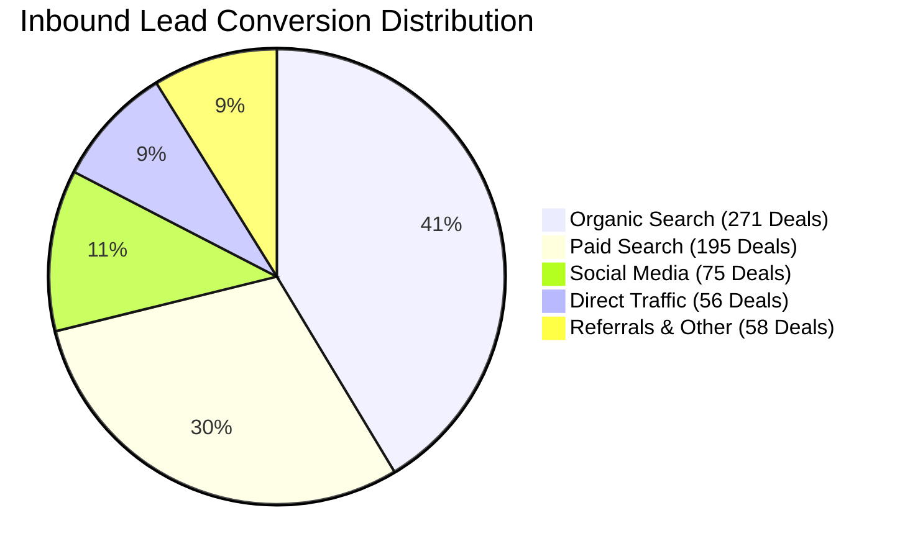
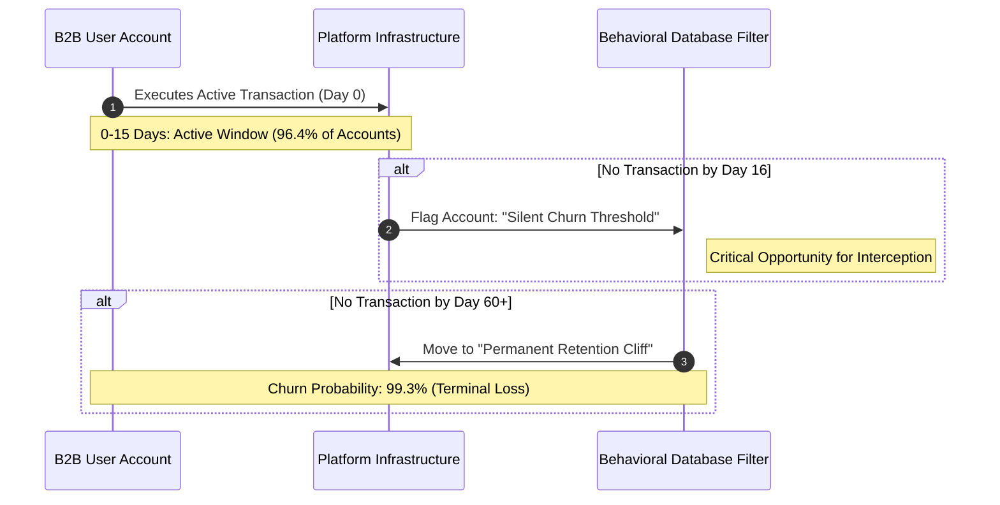

# B2B Ecosystem Revenue Leakage and Onboarding Audit

**Analytical Framework:** Marketplace-to-SaaS Architecture Mapping  
**Dataset Reference:** Olist E-Commerce Infrastructure Ecosystem  
**Target Profile:** Executive Leadership (Chief Revenue Officer, Chief Product Officer, VP of Growth)

---

## 1. Executive Summary: The Value-Gap

High signup volume and contract acquisition rates are vanity metrics masking critical structural failures within this digital ecosystem. This audit isolates severe operational and software bottlenecks that prevent acquired users from achieving their initial value transaction. 

By tracking the lifecycle of B2B users, the underlying SQL database reveals that the platform suffers from massive onboarding setup stagnation and a structural five-month mass attrition event.

### Platform Financial Penalty
The platform fails to activate users rapidly, resulting in immediate written-off acquisition costs and dead subscription loops. The financial damage breaks down as follows:

| Metric Indicator | Base Volume / Value (R\$) | Conversion (USD Equivalent) | Strategic Impact Tier |
| :--- | :--- | :--- | :--- |
| **Non-Started Implementation Accounts** | 462 Accounts | - | Sunk Infrastructure Load |
| **Wasted Acquisition Spend (CAC)** | R\$ 323,400 | ~\$ 64,180 | Sunk Marketing Capital |
| **Annual Subscription Revenue Loss (ARR)** | R\$ 277,200 | ~\$ 54,995 | Compound Margin Degradation |
| **Total Annual Revenue Leakage** | **R\$ 600,600** | **~\$ 119,175** | **Immediate Recovery Target** |

---

## 2. Pipeline Data Integrity and Validation

To ensure the financial models are completely bulletproof against engineering or executive pushback, a comprehensive data sanitization protocol was executed across the relational tables. The core ingestion pipelines are located in [scripts/01_data_ingestion.sql](scripts/01_data_ingestion.sql) and the cleaning sequences are in [scripts/02_data_sanitization.sql](scripts/02_data_sanitization.sql).

*   **Primary Key Integrity:** Verified zero duplicate entries across seller and order architectures, eliminating double-counting risks on gross metrics.
*   **Tracking Logic Validation:** Checked chronological synchronization. Verified that zero sales transactions occurred prior to official account validation dates, checking for CRM logging errors.
*   **Schema Normalization:** Identified severe metadata gaps in product classification catalogs. Found non-indexed categories lacking standard localization strings. These records were manually enriched into the data dictionary to avoid reporting skew.

---

## 3. Funnel Conversion and Implementation Latency

The data disproves the assumption that a highly automated, self-serve onboarding interface guarantees rapid user activation. Users stall for multiple quarters before generating platform value.

### A. Acquisition Funnel Efficiency
An evaluation of inbound channels reveals a stark misalignment between traffic volume and real subscription conversion. Social infrastructure scales volume but degrades baseline conversion quality:

| Inbound Traffic Origin | Total Leads Generated | Engaged Sessions | Validated Closed Deals | Blended Conversion Rate |
| :--- | :--- | :--- | :--- | :--- |
| **Organic Search** | 2,296 | 2,296 | 271 | **11.80%** |
| **Paid Search** | 1,586 | 1,586 | 195 | **12.30%** |
| **Social Media** | 1,350 | 1,350 | 75 | **5.56%** |
| **Direct Traffic** | 499 | 499 | 56 | **11.22%** |
| **Email Marketing** | 493 | 493 | 15 | **3.04%** |
| **Referrals** | 284 | 284 | 24 | **8.45%** |
| **Display Ads** | 118 | 118 | 6 | **5.08%** |
| **Other Publicities** | 65 | 65 | 3 | **4.62%** |

### B. Onboarding Latency (Time-to-Value)
Once an account is validated, the time required to complete domain routing, compliance profiling, and product mapping varies drastically by industry-specific vertical:
*   **High-Ticket, Low-Velocity Verticals (Home / Office / Furniture):** Average 38 days to clear the pipeline.
*   **High-SKU Verticals (Computers / Watches / Health):** Average 49 days, identifying data catalog upload friction.
*   **High-Compliance / Logistically Complex Verticals:** Average 112 days to complete domain routing and tax mapping.

An onboarding latency exceeding 100 days for complex business segments represents a structural product failure. Users pay system maintenance overhead while sitting idle in extended implementation phases, driving immediate user frustration and early cancellations.

---

## 4. Behavioral Churn and The Frustration Spike

Once users exit the onboarding phase, their long-term customer lifetime value is actively degraded by operational and fulfillment failures embedded within the platform's infrastructure.

### The 15-Day Momentum Loop
The platform operates on a rigid transactional cycle. The graph below outlines the progression an account takes after registering an entry:

### Churn Graph Breakdown
1. **The Active Window (Steps 1–2):** 96.42% of the active population moves cleanly inside a 15-day cycle. As long as a transaction occurs here, account momentum is sustained.
2. **The Silent Churn Threshold (Steps 3–4):** On Day 16 of inactivity, the user exits the standard behavioral loop. This is a critical product dead zone where the user has quietly abandoned the dashboard, but traditional metrics have not flagged them as lost.
3. **The Terminal Retention Cliff (Steps 5–6):** If inactivity crosses the 60-day mark, the probability of recovery drops below 1%. At this stage, the account hits a permanent retention cliff, resulting in terminal churn.

| Inactivity Pacing Window | Historical Records Count | Population Percentage | Risk Allocation Status |
| :--- | :--- | :--- | :--- |
| **0–15 Days Inactive** | 214,258 | 96.42% | Healthy / Active Loop |
| **16–30 Days Inactive** | 4,247 | 1.91% | **Slipping Phase Threshold** |
| **31–60 Days Inactive** | 2,299 | 1.03% | **Critical Attrition Warning** |
| **60+ Days (The Churn Red Zone)** | 1,401 | 0.63% | **Terminal Retention Cliff** |

### Operational Frustration Penalty
*   **Gross Revenue Active At-Risk:** R\$967,622.72 (~\$191,920 USD)
*   **Affected Cohort:** 861 Active Accounts

Platform delivery delays exceeding 3 days beyond estimated thresholds show a direct correlation with immediate 1-star user reviews. In an infrastructure ecosystem, when backend processing or logistics handoffs cause systemic delays, end-customers penalize the seller. The seller becomes frustrated by system-induced bad reviews and initiates account abandonment.

---

## 5. Foundational Data Nuances

To maintain absolute credibility, the documentation accounts for critical historical and structural data variables:

1.  **Exogenous Macro Anomalies (The 2018 Trucker Strike):** A nationwide, 10-day transportation blockade occurred in May 2018. This macro event explains the -12.43% drop in platform volume observed in June 2018, representing an environmental anomaly rather than baseline software churn.
2.  **Cross-Vendor Data Duplication:** When an end-customer processes an order containing multiple items from independent sellers, standard relational joins double-count macro metrics. This analysis strictly operates at the granular item vector to isolate unique revenue attributions per individual vendor account.
3.  **The Seller Paradox:** Specific anomalies occur where accounts experience fulfillment delays exceeding 100 days yet retain a 5.0 sentiment rating. These represent resilient power users who utilize highly proactive manual communication to compensate for platform infrastructure limitations, providing a blueprint for manual customer success interventions.

---

## 6. Strategic Recommendations and Corrective Interventions

To capture and recover the R\$600,600 in leaked pipeline value and stabilize the 5-month attrition cliff, the platform must transition away from passive support interfaces and implement automated behavioral workflows. The target implementation framework is mapped across [scripts/03_funnel_and_latency.sql](scripts/03_funnel_and_latency.sql) and [scripts/04_churn_and_recovery.sql](scripts/04_churn_and_recovery.sql).

### Action 1: Deploy a Sandboxed Staging Activation Flow
*   **The Issue:** Logistically complex and high-compliance verticals stall for 100+ days trying to clear domain mapping, tax compliance, and payment routing before seeing value.
*   **The Fix:** Compress Time-to-Value by launching accounts instantly inside a sandbox staging environment utilizing a temporary system-generated URL and standard mock payment processors. 
*   **The Impact:** The user experiences their system operational within 5 minutes. Once they achieve this initial momentum, they are structurally incentivized to complete complex compliance forms.

### Action 2: Build a Programmatic Day-16 Automated Trigger
*   **The Issue:** Automated marketing re-engagement flows deploy too late (at 30 or 60 days), after the user has already abandoned the platform.
*   **The Fix:** Program a real-time behavioral database filter that flags accounts immediately upon hitting Day 16 of transaction inactivity. 
*   **The Action:** Fire a highly specific, contextual UI prompt or account-health checkup workflow directly into the user’s admin panel on Day 16, intercepting the user before they slip off the 60-day retention cliff.

### Action 3: Implement a Bifurcated Support Architecture
*   **The Issue:** The platform treats low-complexity self-serve accounts and high-complexity business accounts identically, stalling both.
*   **The Fix:** Split operational resources based on user data personas:
    1.  *Low-Friction Verticals:* Keep entirely automated, using self-serve interactive step checkers.
    2.  *High-Friction Verticals:* Allocate a portion of the sales acquisition commission to deploy dedicated onboarding success concierges for a live 15-minute integration screenshare.
*   **The ROI Justification:** Allocating R\$50 in specialized support to clear a domain or payment gate directly saves a R\$700 customer acquisition cost that would otherwise be written off as a total loss.

---
**Repository Maintainer:** Hafsa | Data Infrastructure and Growth Analyst

